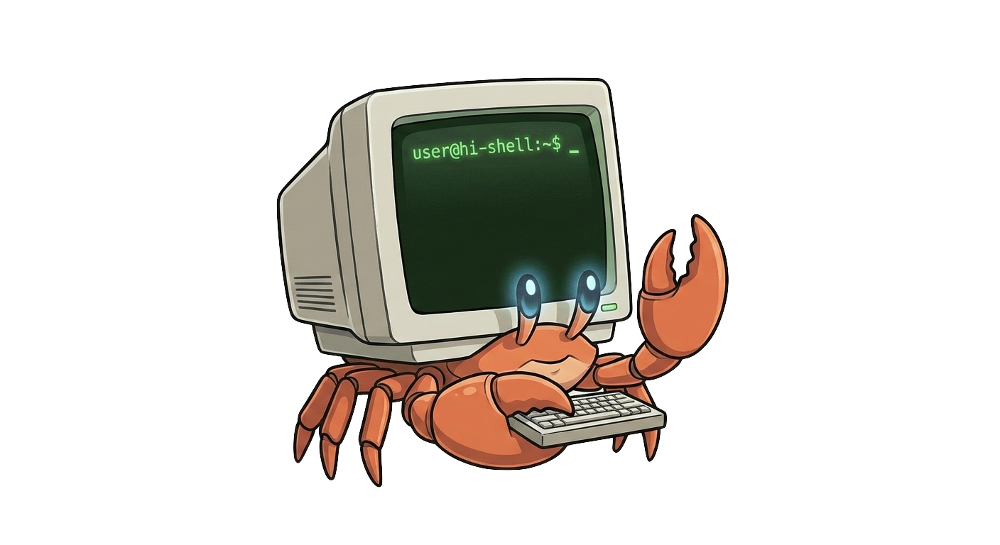

# hi-shell 🐚

<p align="center">
  
</p>

<details>
<summary>🎨 Mascot prompt (click to expand)</summary>

> A cute mascot character that is a small hermit crab. Instead of a natural seashell on its back, it carries a retro-futuristic CRT terminal monitor as its shell. The screen of the monitor glows green and displays a bash prompt `user@hi-shell:~$ _` with a blinking cursor. The crab has friendly robotic claws, one is typing on a tiny keyboard integrated into the monitor base, and the other is making a "stop/safe" gesture. The crab's eyes are intelligent and glowing blue. The overall vibe is helpful, robust, and smart. Illustration style, clean lines, transparent background.

</details>

---

👋 **hi-shell**: An intelligent terminal assistant that translates your natural language descriptions into executable bash commands.

`hi-shell` helps you bridge the gap between "what I want to do" and "how do I write that command?". Whether you're a terminal veteran or a newcomer, `hi-shell` provides a fast, AI-powered way to generate and execute commands safely.

## Should be test before 1.0.0 release:

- [x] embedded models
- [x] local models (tested lmstudio and ollama)
- [ ] cloud models (tested openrouter, gemini, custom, need to test with antrophic)
- [x] interactive mode
- [x] one-shot mode
- [x] safety features
- [x] telemetry
- [x] release workflow works
- [ ] cargo publish works
- [x] homebrew update works
- [x] scoop update works
- [ ] works on linux
- [x] works on windows

## ✨ Features

- **Multi-LLM Support**:
  - **Embedded**: Run models locally using `candle` with hardware acceleration (Metal/CUDA). Supports Llama, Phi-3, and Qwen2 architectures.
  - **Local**: Connect to your own Ollama or LM Studio instance.
  - **Cloud**: Integration with OpenRouter, Gemini, and Anthropic.
- **Interactive REPL**: A dedicated shell environment for continuous assistance.
- **One-shot Mode**: Get quick answers directly from your command line.
- **Safety First**: Dangerous commands are flagged, and confirmation is required before execution.
- **Telemetry**: Optional anonymous usage stats to help improve the tool.

## 🚀 Installation

You can install `hi-shell` using your preferred method:

### ⚡ Quick Install (macOS & Linux)
```bash
curl -sSL https://raw.githubusercontent.com/tufantunc/hi-shell/main/install.sh | bash
```

### 🍏 Homebrew (macOS & Linux)
```bash
brew tap tufantunc/tap
brew install hi-shell
```

### 🪟 Scoop (Windows)
```powershell
scoop bucket add hi-shell https://github.com/tufantunc/scoop-bucket
scoop install hi-shell
```

### 🦀 Cargo
If you have Rust installed, you can install it via Cargo:
```bash
# Install via crates.io
cargo install hi-shell

# OR install pre-compiled binary via cargo-binstall
cargo binstall hi-shell
```

### 📦 Manual Download
You can download the pre-built binaries for your operating system from the [Releases](https://github.com/tufantunc/hi-shell/releases) page.

1. Download the version corresponding to your OS (macOS, Linux, or Windows).
2. Move the binary to a folder in your `PATH`.
3. Run `hi-shell --init` to set up your preferred LLM provider.

## 🔄 Updating

### 🍏 Homebrew (macOS & Linux)
```bash
brew update && brew upgrade hi-shell
```

### 🪟 Scoop (Windows)
```powershell
scoop update
scoop update hi-shell
```

### 🦀 Cargo
```bash
cargo install hi-shell
# OR
cargo binstall hi-shell
```

### ⚡ Quick Install Script
Re-run the install script to get the latest version:
```bash
curl -sSL https://raw.githubusercontent.com/tufantunc/hi-shell/main/install.sh | bash
```

## 🛠 Development

If you'd like to contribute or build from source, follow these steps.

### Prerequisites

- [Rust](https://www.rust-lang.org/tools/install) (latest stable version recommended)
- C Compiler (for some dependencies)

### Cloning the Repository

```bash
git clone https://github.com/tufantunc/hi-shell.git
cd hi-shell
```

### Building from Source

You can build the project for your specific platform using Cargo.

#### 🍏 macOS (with Metal support)
```bash
cargo build --release --features metal
```

#### 🐧 Linux
```bash
cargo build --release
```

#### 𝝿 Linux (with CUDA support)
```bash
cargo build --release --features cuda
```

#### 🪟 Windows
```bash
cargo build --release
```

The compiled binary will be located in `target/release/hi-shell`.

## 🧠 Embedded Models

When using the embedded LLM provider, hi-shell downloads and runs GGUF models locally. 

### Supported Architectures
- **Llama** (Llama 2, Llama 3, Llama 3.2)
- **Phi-3** (Phi-3-mini)
- **Qwen2** (Qwen2, Qwen2.5, Qwen2.5-Coder)

### Recommended Quantization
Use **Q4_K_M** or **Q5_K_M** quantization formats for best compatibility. Lower quantization levels (Q2_K) may not be supported.

### Model Management
```bash
# View and manage downloaded models
hi-shell --models
```

## 🤝 Contributing

Contributions are welcome! Please read our [Contributing Guide](CONTRIBUTING.md) before submitting issues or pull requests.

## 📄 License

This project is licensed under the [MIT License](LICENSE).
